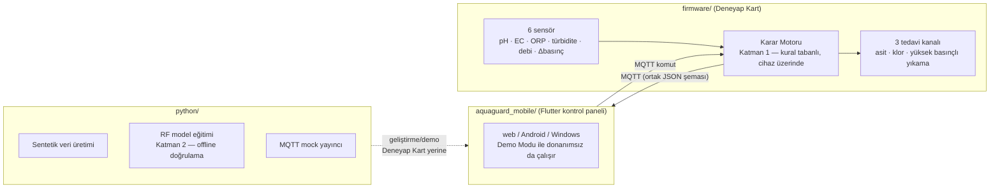

# AquaGuard

[](https://github.com/beyzanuryavuztr/aquaguard/actions/workflows/ci.yml)

**Toprak altı damla sulama (SDI) sistemlerinde damlatıcı tıkanmasını türüne
göre (kimyasal / biyolojik / fiziksel) otonom teşhis eden ve tedavi eden bir
tıkanma yönetim sistemi.**

Sahada tıkanma türünü doğrudan belirleyecek bir yöntem literatürde
tanımlanmamıştır. AquaGuard; 6 sensörden (pH, EC, ORP, türbidite, debi,
diferansiyel basınç) gelen veriyi iki katmanlı bir karar motoruyla
(kural tabanlı birincil katman + Random Forest ile offline doğrulama)
değerlendirir, tıkanmanın türünü belirler ve 3 tedavi kanalından
(asit dozlama / klor enjeksiyonu / yüksek basınçlı yıkama) uygun olanını
otonom olarak devreye alır.

TEKNOFEST 2026 Tarım Teknolojileri Yarışması, Kategori 3.3 (Toprak Altı
Sulama Sistemleri) kapsamında Arge-T HydroLab takımı tarafından geliştirildi.

## Mimari



Sensör okuma JSON şeması (`guven_kimyasal`/`guven_biyolojik`/`guven_fiziksel`
dahil) firmware, Python ve Flutter tarafında **bayt bayt aynı** tutulur —
üçü de aynı karar mantığının bağımsız birer uygulamasıdır, tek kaynak üç
yerde senkron tutulur.

### MQTT veri şeması (örnek)

`aquaguard/zone{N}/veri` konusuna, cihaz her ölçüm döngüsünde aşağıdaki
şekle sahip bir JSON yayınlar (alan adları `lib/models/sensor_okuma.dart`
`toJson()`/`fromJson()` ile birebir — `hazne_*` alanları opsiyoneldir,
gerçek donanımda henüz hazne seviye sensörü olmadığı için `null` gelir ve
UI o kartı hiç göstermez):

```json
{
  "zaman": "2026-09-18T14:32:07.000Z",
  "zone": 2,
  "ph": 6.8,
  "ec": 1.42,
  "orp": 312.5,
  "turbidite": 3.1,
  "debi": 8.4,
  "delta_basinc": 0.62,
  "durum": "tespitEdildi",
  "tikanma_turu": "kimyasal",
  "guven": 0.87,
  "guven_kimyasal": 0.87,
  "guven_biyolojik": 0.06,
  "guven_fiziksel": 0.07,
  "tedavi_aktif": "asitDozlama",
  "durulama_aktif": false,
  "hazne_asit_seviye_yuzde": null,
  "hazne_klor_seviye_yuzde": null
}
```

`durum` ∈ `normal | belirsiz | tespitEdildi | bilinmiyor`,
`tikanma_turu` ∈ `yok | kimyasal | biyolojik | fiziksel`,
`tedavi_aktif` ∈ `yok | asitDozlama | klorEnjeksiyon | yuksekBasincliYikama`.
Mobil uygulama, aynı şemayı `aquaguard/zone{N}/komut` konusuna manuel
müdahale/durdurma komutları göndermek için de kullanır.

## Ekran görüntüleri

> Bu depoyu klonlayıp `flutter run -d chrome` ile çalıştırdığınızda göreceğiniz
> 4 ana ekran: Genel Bakış (zon şeması + sistem sağlığı), Tıkanma Detay
> (sensör trendleri + gauge), Tedavi Geçmişi (başarı oranı + tespit günlüğü),
> Ayarlar (Görünüm/erişilebilirlik + MQTT/güvenlik). Ekran görüntüleri henüz
> bu depoya eklenmedi — `docs/screenshots/` altına gerçek Chrome
> görüntüleri eklenip buraya bağlanacak (bkz. `CHANGELOG.md`).

## Klasör yapısı

| Klasör | İçerik |
|---|---|
| `firmware/` | Deneyap Kart C++ firmware — sensör okuma, karar motoru (Katman 1), 3 tedavi kanalı, MQTT haberleşme |
| `python/` | Sentetik veri üretici, Random Forest karar motoru (Katman 2, offline doğrulama), MQTT mock yayıncı, pytest test paketi |
| `aquaguard_mobile/` | Flutter kontrol paneli (web/Android/Windows) — Demo Modu, gerçek zamanlı izleme, tedavi geçmişi, trend analizi |
| `PROJE_BRIEF.md` | Projenin tam teknik özeti (donanım mimarisi, sensör eşikleri, tedavi kuralları) |

## Kurulum ve çalıştırma

### Ön koşullar

| Araç | Sürüm |
|---|---|
| Flutter SDK | 3.x (stable kanal) — `flutter --version` ile doğrulayın |
| Python | 3.10+ |
| Deneyap Kart IDE | firmware derlemesi için (opsiyonel, donanım yoksa gerekmez) |

### Flutter mobil/web uygulaması

```bash
cd aquaguard_mobile
flutter pub get
flutter run -d chrome   # web (önerilen ilk test ortamı)
```

Uygulama ilk açılışta **Demo Modu**'nda başlar — gerçek donanım
bağlanmamışsa bile tamamen simüle edilmiş, gerçekçi bir tıkanma senaryosu
gösterir, hiçbir ağ bağlantısı gerekmez. Gerçek Deneyap Kart'a bağlanmak
için Ayarlar'dan Demo Modu'nu kapatıp MQTT broker bilgilerini girin.

Testler:

```bash
flutter analyze
flutter test
```

### Python (karar motoru / veri üretimi)

```bash
cd python
pip install -r requirements.txt
python aquaguard_veri_uretici.py       # sentetik veri seti üretir
python aquaguard_karar_motoru.py       # RF modelini eğitir, doğrular
pytest                                  # test paketini çalıştırır
```

### Firmware

`firmware/aquaguard_main.ino` Deneyap Kart IDE ile derlenip yüklenir.
Pin/kalibrasyon sabitleri `config.h` içindedir. Gerçek donanıma flaşlamadan
önce [`firmware/DONANIM_KONTROL_LISTESI.md`](firmware/DONANIM_KONTROL_LISTESI.md)'ye
bakın (pin doğrulaması, kalibrasyon adımları, ilk çalıştırma duman testi sırası).

> **CI notu:** `.github/workflows/ci.yml` şu an sadece Flutter ve Python
> tarafını otomatik doğruluyor. Firmware derlemesi CI'ya bilerek dahil
> edilmedi — Deneyap Kart, Arduino CLI'nin varsayılan board index'inde
> yok ve doğrulanmamış bir FQBN ile pipeline eklemek yanıltıcı olurdu.
> Firmware CI, board-manager URL'i donanım ekibiyle doğrulandıktan sonra
> eklenecek bir sonraki adımdır.

### Güvenlik notu (MQTT)

Geliştirme/demo ortamında herkese açık bir test broker'ı (`test.mosquitto.org`)
kullanılır — üretimde **kendi broker'ınızı** (Mosquitto/EMQX) TLS
sertifikasıyla çalıştırın ve bir ACL dosyasıyla her cihazın **sadece kendi
zon konusuna** (`aquaguard/zone{N}/veri` vb.) yazabilmesini, mobil
uygulamanın ise sadece `komut` konusuna yazıp `veri`/`durum` konularını
okuyabilmesini sağlayın. Ayarlar ekranındaki "Güvenli Bağlantı (TLS)"
anahtarı açıldığında uygulama TLS (8883) veya WSS (8081) üzerinden
bağlanır; bu, sunucu tarafında TLS dinleyicisi açık bir broker gerektirir.

## Durum

Yazılım (Python karar motoru + Flutter uygulaması) bu depoda geliştirilip
test edilmiştir. Firmware, gerçek donanımda (Deneyap Kart + 6 sensör + 3
tedavi kanalı) doğrulanmayı beklemektedir.

## Katkıda bulunma

Bu depo şu an aktif geliştirme aşamasında, ancak temel iş akışı şöyledir:

1. Değişikliğinizi bir dalda yapın, ilgili alt proje için mevcut testleri
   çalıştırın (`flutter analyze --fatal-infos` + `flutter test` Flutter
   tarafında, `pytest` Python tarafında).
2. Sensör okuma şemasını değiştiriyorsanız (`lib/models/sensor_okuma.dart`,
   `python/aquaguard_mock_yayinci.py`, `firmware/mqtt_handler.h`) **üçünü
   de** güncelleyin — tek kaynak üç yerde elle senkron tutulur, bkz.
   [Mimari](#mimari).
3. Commit mesajlarında [Conventional Commits](https://www.conventionalcommits.org/)
   önekleri kullanın (`fix:`, `feat:`, `refactor:`, `chore:`, `docs:`,
   `test:`, `ci:`) — bu depoda zaten tutarlı şekilde uygulanıyor, `git log`
   ile örneklere bakabilirsiniz.
4. CI (`.github/workflows/ci.yml`) her PR'da Flutter analyze/test ve Python
   pytest'i otomatik çalıştırır; kırmızı CI ile birleştirme yapılmaz.
5. Demo/sentetik veri her zaman gerçek veriden **açıkça ayırt edilebilir**
   olmalı (örn. "İstatistiksel eğilim, tahmin değildir" gibi notlar) —
   projenin dürüstlük ilkesi, hiçbir ekran gerçek olmayan bir ölçümü gerçek
   gibi göstermez.

## Takım

Arge-T HydroLab — TEKNOFEST 2026 Tarım Teknolojileri Yarışması, Kategori 3.3.

| Rol | Sorumluluk |
|---|---|
| Beyzanur | Yazılım, karar motoru, Flutter mobil uygulama |
| Enver | Donanım, sensör entegrasyonu, prototip inşası |
| Dr. Öğr. Üyesi Tuğçem Partal | Danışman |
